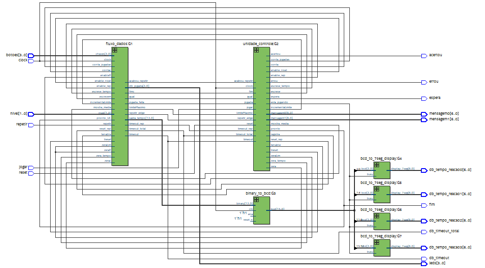
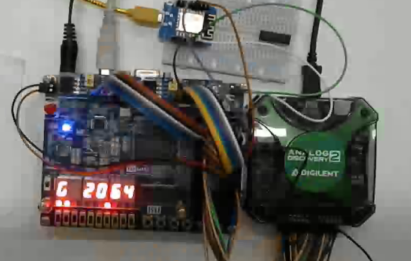

# Projeto Reflexos

Esse projeto foi desenvolvido na disciplina PCS 3635 - Laboratório de Sistemas Digitais I, sobre o projeto base desenvolvido na primeira parte da disciplina. O projeto é inspirado no jogo Genius e em exercícios realizados por pilotos de Fórmula 1 para treinamento de reflexos.

O projeto foi desenvolvido em VHDL no ambiente Quartus Prime. Todo o processo de desenvolvimento semana-a-semana foi documentado e pode ser consultado nesse repositório, bem como um manual e os slides utilizados pelo grupo para a feira de projetos.

## Imagens

Diagrama do circuito final.

Demonstração do projeto na placa FPGA.
